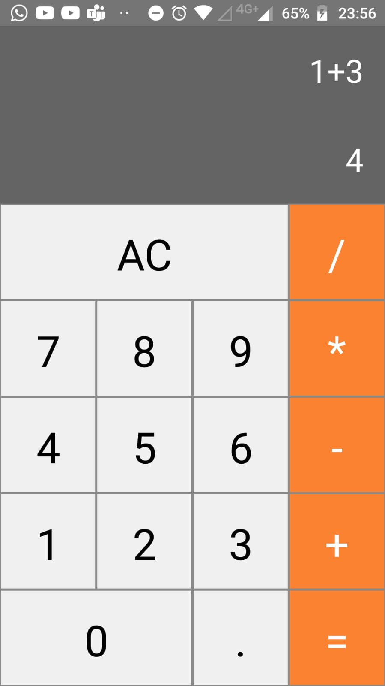

<h1 align="center"> Calculator </h1>

## Descrição do Projeto
<p>A simple calculator in React Native</p>

<h4 align="center"> 
	:white_check_mark:  Finalizado :white_check_mark:
</h4>
 
Tabela de conteúdos
=================
<!--ts-->
   * [Sobre](#descrição-do-projeto)
   * [Como usar](#como-usar)
     * [Pré-Requisitos](#pré-requisitos)
     * [Rodando a aplicação](#-rodando-a-aplicação)
   * [Tecnologias](#-tecnologias)
   * [Demonstração](#demonstração)
   * [Autor](#autor)
   * [Licença](#liçenca)
<!--te-->
 
## Como Usar

### Pré-requisitos

Antes de começar, você vai precisar seguir o passo a passo de como montar seu ambiente React Native detalhado em (https://reactnative.dev/docs/environment-setup).

Além disto é bom ter um editor para trabalhar com o código como [VSCode](https://code.visualstudio.com/)

### 🎲 Rodando a aplicação

```bash
# Clone este repositório
$ git clone <https://github.com/tgmarinho/ItaloRez/calculator/>

# Acesse a pasta do projeto no terminal/cmd
$ cd calculator

# Instale as dependências
$ yarn

# Inicialize o Metro
$ npx react-native start

# Execute a aplicação em um aparelho android
$ npx react-native run-android


```

## 🛠 Tecnologias

As seguintes ferramentas foram usadas na construção do projeto:

- [React Native](https://reactnative.dev/)


## Demonstração

<h1 align="center">
  
</h1>

## Autor

 </img>
 <br/>
 <sub><b>Ítalo de Rezende</b></sub>🚀


Feito por Ítalo de Rezende 👋🏽 Entre em contato!


[](https://www.linkedin.com/in/%C3%ADtalo-rezende-60a5571b2/) 

[](mailto:italo.rezende@gec.inatel.br)


## Licença


